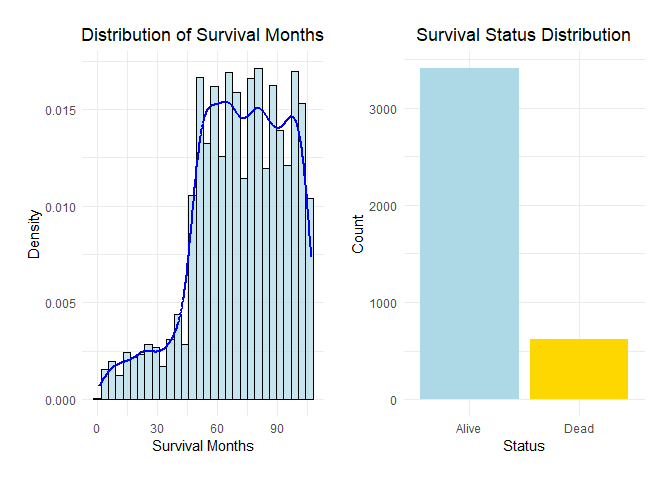

BM EDA
================
Liqi Zhou

``` r
library(tidyverse)
library(flextable)
library(officer)
library(ggplot2)
library(gridExtra)
```

``` r
bcp <- read.csv("Project_2_data.csv") |>
  mutate(across(where(is.character), as.factor))
```

# 1. All variables

a descriptive table with summary statistics for all variables

``` r
bcp |> 
  summarise(across(where(is.numeric), 
                   list(mean = ~mean(.x, na.rm = TRUE),
                        sd = ~sd(.x, na.rm = TRUE),
                        min = ~min(.x, na.rm = TRUE),
                        max = ~max(.x, na.rm = TRUE),
                        median = ~median(.x, na.rm = TRUE),
                        missing = ~sum(is.na(.x))
                   ), 
                   .names = "{.col}_{.fn}")) |> 
  pivot_longer(everything(), 
               names_to = c("Variable", ".value"), 
               names_sep = "_") |>
  knitr::kable()
```

| Variable               |      mean |        sd | min | max | median | missing |
|:-----------------------|----------:|----------:|----:|----:|-------:|--------:|
| Age                    | 53.972167 |  8.963134 |  30 |  69 |     54 |       0 |
| Tumor.Size             | 30.473658 | 21.119696 |   1 | 140 |     25 |       0 |
| Regional.Node.Examined | 14.357107 |  8.099675 |   1 |  61 |     14 |       0 |
| Reginol.Node.Positive  |  4.158052 |  5.109331 |   1 |  46 |      2 |       0 |
| Survival.Months        | 71.297962 | 22.921429 |   1 | 107 |     73 |       0 |

``` r
bcp |> 
  select(where(is.factor)) |>
  pivot_longer(cols = everything(), names_to = "Variable", values_to = "Level") |>
  count(Variable, Level) |>
  group_by(Variable) |>
  mutate(Proportion = scales::percent(n / sum(n), accuracy = 0.01)) |>
  ungroup() |> 
  arrange(Variable, desc(n)) |> 
  mutate(Variable = ifelse(duplicated(Variable), "", Variable)) |>  
  knitr::kable(col.names = c("Variable", "Level", "Count", "Proportion"))
```

| Variable            | Level                     | Count | Proportion |
|:--------------------|:--------------------------|------:|:-----------|
| A.Stage             | Regional                  |  3932 | 97.71%     |
|                     | Distant                   |    92 | 2.29%      |
| Estrogen.Status     | Positive                  |  3755 | 93.32%     |
|                     | Negative                  |   269 | 6.68%      |
| Grade               | 2                         |  2351 | 58.42%     |
|                     | 3                         |  1111 | 27.61%     |
|                     | 1                         |   543 | 13.49%     |
|                     | anaplastic; Grade IV      |    19 | 0.47%      |
| Marital.Status      | Married                   |  2643 | 65.68%     |
|                     | Single                    |   615 | 15.28%     |
|                     | Divorced                  |   486 | 12.08%     |
|                     | Widowed                   |   235 | 5.84%      |
|                     | Separated                 |    45 | 1.12%      |
| N.Stage             | N1                        |  2732 | 67.89%     |
|                     | N2                        |   820 | 20.38%     |
|                     | N3                        |   472 | 11.73%     |
| Progesterone.Status | Positive                  |  3326 | 82.65%     |
|                     | Negative                  |   698 | 17.35%     |
| Race                | White                     |  3413 | 84.82%     |
|                     | Other                     |   320 | 7.95%      |
|                     | Black                     |   291 | 7.23%      |
| Status              | Alive                     |  3408 | 84.69%     |
|                     | Dead                      |   616 | 15.31%     |
| T.Stage             | T2                        |  1786 | 44.38%     |
|                     | T1                        |  1603 | 39.84%     |
|                     | T3                        |   533 | 13.25%     |
|                     | T4                        |   102 | 2.53%      |
| X6th.Stage          | IIA                       |  1305 | 32.43%     |
|                     | IIB                       |  1130 | 28.08%     |
|                     | IIIA                      |  1050 | 26.09%     |
|                     | IIIC                      |   472 | 11.73%     |
|                     | IIIB                      |    67 | 1.67%      |
| differentiate       | Moderately differentiated |  2351 | 58.42%     |
|                     | Poorly differentiated     |  1111 | 27.61%     |
|                     | Well differentiated       |   543 | 13.49%     |
|                     | Undifferentiated          |    19 | 0.47%      |

# 2. Outcome

## Survival.Months & Status

``` r
library(ggplot2)
library(patchwork)

plot1 <- ggplot(bcp, aes(x = Survival.Months)) +
  geom_histogram(aes(y = after_stat(density)), bins = 30, fill = "lightblue", color = "black", alpha = 0.7) +
  geom_density(color = "blue", linewidth = 1) +
  labs(title = "Distribution of Survival Months",
       x = "Survival Months",
       y = "Density") +
  theme_minimal() +
  theme(plot.title = element_text(hjust = 0.5))

plot2 <- ggplot(bcp, aes(x = Status, fill = Status)) +
  geom_bar() +
  scale_fill_manual(values = c("lightblue", "gold")) +
  labs(title = "Survival Status Distribution",
       x = "Status",
       y = "Count") +
  theme_minimal() +
  theme(legend.position = "none", 
        plot.title = element_text(hjust = 0.5))

combined_plot <- plot1 + plot2 + 
  plot_layout(ncol = 2) & 
  theme(plot.margin = margin(10, 10, 10, 10))

combined_plot
```

<!-- -->

# 3. Predictors

## numeric

``` r
plot_continuous_density_box <- function(var_name) {
  p1 <- ggplot(bcp, aes_string(x = var_name)) +
    geom_density(fill = "skyblue", alpha = 0.7, color = "blue") +
    labs(title = paste("Density Plot of", var_name), 
         x = var_name, 
         y = "Density") +
    theme_minimal()
  
  p2 <- ggplot(bcp, aes_string(y = var_name)) +
    geom_boxplot(fill = "orange") +
    labs(title = paste("Boxplot of", var_name), 
         y = var_name) +
    theme_minimal()
  
  return(list(p1, p2)) 
}

continuous_vars <- c("Age", "Tumor.Size", "Regional.Node.Examined", "Reginol.Node.Positive")
plots <- lapply(continuous_vars, plot_continuous_density_box)
```

    ## Warning: `aes_string()` was deprecated in ggplot2 3.0.0.
    ## ℹ Please use tidy evaluation idioms with `aes()`.
    ## ℹ See also `vignette("ggplot2-in-packages")` for more information.
    ## This warning is displayed once every 8 hours.
    ## Call `lifecycle::last_lifecycle_warnings()` to see where this warning was
    ## generated.

``` r
left_plots <- do.call(c, lapply(plots, `[`, 1:2)) 

grid.arrange(grobs = left_plots, ncol = 2)
```

<!-- -->

## categorical

``` r
categorical_vars <- bcp |>
  select(1:14) |>
  select(where(is.factor))
  
plot_categorical <- function(var_name) {
  ggplot(bcp, aes_string(x = var_name)) +
    geom_bar(fill = "skyblue", color = "black") +
    labs(title = paste("Frequency of", var_name), x = var_name, y = "Count") +
    theme_minimal()
}

cat_plots <- lapply(names(categorical_vars), plot_categorical)

grid.arrange(grobs = cat_plots, ncol = 2)
```

<!-- -->
