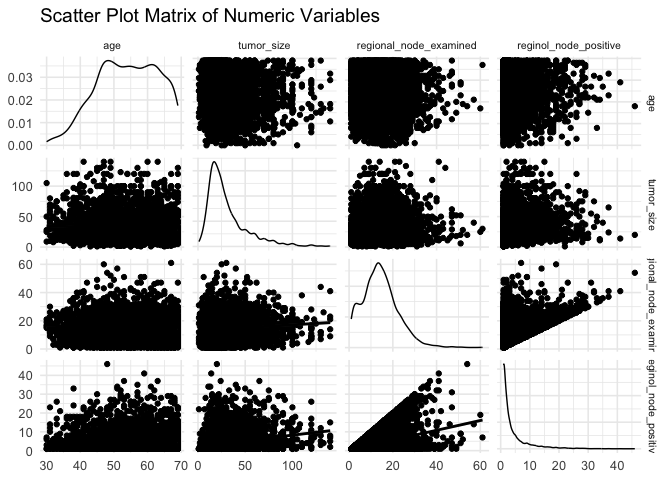

Logistic Model Prediction
================
Fengwei Lei

``` r
library(carData)
library(tidyverse)
library(corrplot)
library(GGally)
library(caret)   
library(glmnet)  
library(pROC)    
library(car)
library(rsample)
library(knitr)
library(kableExtra)
```

### Load Data and Cleaning

``` r
data <- read.csv("Project_2_data.csv") |> 
  janitor::clean_names() |>
  subset(select = -c(survival_months)) |>
  mutate(grade = as.character(grade)) |>  
  mutate(grade = ifelse(trimws(tolower(grade)) == "anaplastic; grade iv", "4", grade)) |> 
  rename(stage_six = x6th_stage) |> 
  mutate(
    t_stage = factor(t_stage),
    race = factor(race),
    marital_status = factor(trimws(marital_status)),
    n_stage = factor(n_stage),
    stage_six = factor(stage_six),
    differentiate = factor(differentiate),
    a_stage = factor(a_stage), 
    estrogen_status = factor(estrogen_status),
    progesterone_status = factor(progesterone_status), 
    status = factor(status),
    grade = factor(grade)  
  )
```

### Collinearity

``` r
grade_diff_table <- table(data$grade, data$differentiate)
print(grade_diff_table)
```

    ##    
    ##     Moderately differentiated Poorly differentiated Undifferentiated
    ##   1                         0                     0                0
    ##   2                      2351                     0                0
    ##   3                         0                  1111                0
    ##   4                         0                     0               19
    ##    
    ##     Well differentiated
    ##   1                 543
    ##   2                   0
    ##   3                   0
    ##   4                   0

``` r
data <- data |> select(-differentiate)
```

``` r
chisq_test_result <- chisq.test(table(data$stage_six, data$n_stage))
print(chisq_test_result)
```

    ## 
    ##  Pearson's Chi-squared test
    ## 
    ## data:  table(data$stage_six, data$n_stage)
    ## X-squared = 6686.8, df = 8, p-value < 2.2e-16

``` r
if (chisq_test_result$p.value < 0.05) {
  cat("6th Stage and N Stage are not independent，delete 6th Stage. \n")
  data <- data |> select(-stage_six)
}
```

    ## 6th Stage and N Stage are not independent，delete 6th Stage.

``` r
scatter_plot <- ggplot(data, aes(x = regional_node_examined, y = reginol_node_positive)) +
  geom_point() +  
  labs(
    title = "Scatter Plot of Regional Nodes Examined vs Reginol Node Positive",
    x = "Regional Node Examined",
    y = "Reginol Node Positive"
  ) +
  theme_minimal()
scatter_plot
```

<!-- -->

``` r
regional_cor_matrix <- cor(
  data |> 
    select(regional_node_examined, reginol_node_positive), use = "complete.obs")
regional_cor_matrix
```

    ##                        regional_node_examined reginol_node_positive
    ## regional_node_examined              1.0000000             0.4115797
    ## reginol_node_positive               0.4115797             1.0000000

``` r
cor_matrix_plot <- ggplot(
  data = as.data.frame(as.table(regional_cor_matrix)), aes(Var1, Var2, fill = Freq)) +
  geom_tile() +
  scale_fill_gradient2(low = "blue", high = "red", mid = "white", midpoint = 0, limit = c(-1, 1)) +
  theme_minimal() +
  labs(title = "Correlation Matrix", x = "", y = "")
cor_matrix_plot
```

<!-- -->

``` r
data <- data |> 
  mutate(
    node_positive_rate = reginol_node_positive / regional_node_examined,
    node_positive_rate = ifelse(is.nan(node_positive_rate) | is.infinite(node_positive_rate), NA, node_positive_rate)
  ) |> 
  select(-reginol_node_positive, -regional_node_examined)
```

**VIF**

``` r
logistic_model <- glm(status ~.,
                      data = data, family = binomial)

vif_values <- vif(logistic_model)
vif_values
```

    ##                         GVIF Df GVIF^(1/(2*Df))
    ## age                 1.108265  1        1.052742
    ## race                1.061598  2        1.015056
    ## marital_status      1.135421  4        1.016002
    ## t_stage             4.276530  3        1.274037
    ## n_stage             1.810702  2        1.160010
    ## grade               1.119327  3        1.018966
    ## a_stage             1.260379  1        1.122666
    ## tumor_size          3.657529  1        1.912467
    ## estrogen_status     1.479164  1        1.216209
    ## progesterone_status 1.429609  1        1.195663
    ## node_positive_rate  1.635114  1        1.278716

``` r
high_vif <- vif_values[vif_values > 5]
if (length(high_vif) > 0) {
  cat("There exits collinearity problem between variables.\n")
  print(high_vif)
} else {
  cat("There is no collinearity problem between variables.\n")
}
```

    ## There is no collinearity problem between variables.

### train-test split

``` r
set.seed(123)
train_test_split <- initial_split(data, prop = 0.7)
train_data <- training(train_test_split)
test_data <- testing(train_test_split)
```

### Stepwise Selection

``` r
initial_model <- glm(status ~ ., data = train_data, family = binomial)


stepwise_model <- step(initial_model, direction = "both", trace = 0)


important_vars <- names(coef(stepwise_model))[-1]  
important_vars
```

    ##  [1] "age"                         "raceOther"                  
    ##  [3] "raceWhite"                   "t_stageT2"                  
    ##  [5] "t_stageT3"                   "t_stageT4"                  
    ##  [7] "n_stageN2"                   "n_stageN3"                  
    ##  [9] "grade2"                      "grade3"                     
    ## [11] "grade4"                      "estrogen_statusPositive"    
    ## [13] "progesterone_statusPositive" "node_positive_rate"

``` r
train_data_new =train_data |> 
  select(age, race, t_stage, n_stage, grade, estrogen_status, progesterone_status, node_positive_rate, status)

test_data_new = test_data |> 
  select(age, race, t_stage, n_stage, grade, estrogen_status, progesterone_status, node_positive_rate, status)

main_effects_model <- glm(status~. , data = train_data_new, family = binomial)
summary(main_effects_model)
```

    ## 
    ## Call:
    ## glm(formula = status ~ ., family = binomial, data = train_data_new)
    ## 
    ## Coefficients:
    ##                              Estimate Std. Error z value Pr(>|z|)    
    ## (Intercept)                 -2.773043   0.489347  -5.667 1.45e-08 ***
    ## age                          0.020356   0.006536   3.114 0.001843 ** 
    ## raceOther                   -0.851232   0.289244  -2.943 0.003251 ** 
    ## raceWhite                   -0.509366   0.190174  -2.678 0.007397 ** 
    ## t_stageT2                    0.562564   0.134932   4.169 3.06e-05 ***
    ## t_stageT3                    0.414689   0.185869   2.231 0.025676 *  
    ## t_stageT4                    1.173685   0.280446   4.185 2.85e-05 ***
    ## n_stageN2                    0.305508   0.144937   2.108 0.035043 *  
    ## n_stageN3                    0.668109   0.188827   3.538 0.000403 ***
    ## grade2                       0.576922   0.226297   2.549 0.010791 *  
    ## grade3                       0.867728   0.237584   3.652 0.000260 ***
    ## grade4                       1.794738   0.672543   2.669 0.007617 ** 
    ## estrogen_statusPositive     -0.789002   0.210828  -3.742 0.000182 ***
    ## progesterone_statusPositive -0.628330   0.154441  -4.068 4.73e-05 ***
    ## node_positive_rate           1.157761   0.224567   5.156 2.53e-07 ***
    ## ---
    ## Signif. codes:  0 '***' 0.001 '**' 0.01 '*' 0.05 '.' 0.1 ' ' 1
    ## 
    ## (Dispersion parameter for binomial family taken to be 1)
    ## 
    ##     Null deviance: 2389.7  on 2815  degrees of freedom
    ## Residual deviance: 2078.7  on 2801  degrees of freedom
    ## AIC: 2108.7
    ## 
    ## Number of Fisher Scoring iterations: 5

### Considering Interactions

``` r
interaction_model_1 <- glm(status ~ age * race + t_stage + n_stage + grade + estrogen_status + progesterone_status + node_positive_rate, 
                         data = train_data_new, family = binomial)
summary(interaction_model_1)
```

    ## 
    ## Call:
    ## glm(formula = status ~ age * race + t_stage + n_stage + grade + 
    ##     estrogen_status + progesterone_status + node_positive_rate, 
    ##     family = binomial, data = train_data_new)
    ## 
    ## Coefficients:
    ##                              Estimate Std. Error z value Pr(>|z|)    
    ## (Intercept)                 -1.856286   1.035266  -1.793 0.072965 .  
    ## age                          0.002968   0.018582   0.160 0.873110    
    ## raceOther                   -0.725295   1.601875  -0.453 0.650708    
    ## raceWhite                   -1.666570   1.068260  -1.560 0.118741    
    ## t_stageT2                    0.563947   0.134982   4.178 2.94e-05 ***
    ## t_stageT3                    0.414910   0.185766   2.234 0.025515 *  
    ## t_stageT4                    1.171198   0.280819   4.171 3.04e-05 ***
    ## n_stageN2                    0.308555   0.145132   2.126 0.033500 *  
    ## n_stageN3                    0.676122   0.189194   3.574 0.000352 ***
    ## grade2                       0.577228   0.226478   2.549 0.010812 *  
    ## grade3                       0.872039   0.237790   3.667 0.000245 ***
    ## grade4                       1.787039   0.670805   2.664 0.007721 ** 
    ## estrogen_statusPositive     -0.790928   0.210701  -3.754 0.000174 ***
    ## progesterone_statusPositive -0.630860   0.154523  -4.083 4.45e-05 ***
    ## node_positive_rate           1.159189   0.224879   5.155 2.54e-07 ***
    ## age:raceOther               -0.002693   0.030400  -0.089 0.929412    
    ## age:raceWhite                0.021715   0.019878   1.092 0.274655    
    ## ---
    ## Signif. codes:  0 '***' 0.001 '**' 0.01 '*' 0.05 '.' 0.1 ' ' 1
    ## 
    ## (Dispersion parameter for binomial family taken to be 1)
    ## 
    ##     Null deviance: 2389.7  on 2815  degrees of freedom
    ## Residual deviance: 2076.8  on 2799  degrees of freedom
    ## AIC: 2110.8
    ## 
    ## Number of Fisher Scoring iterations: 5

``` r
interaction_model_2 <- glm(status ~  race + age *t_stage + n_stage + grade + estrogen_status + progesterone_status + node_positive_rate, 
                         data = train_data_new, family = binomial)
summary(interaction_model_2)
```

    ## 
    ## Call:
    ## glm(formula = status ~ race + age * t_stage + n_stage + grade + 
    ##     estrogen_status + progesterone_status + node_positive_rate, 
    ##     family = binomial, data = train_data_new)
    ## 
    ## Coefficients:
    ##                             Estimate Std. Error z value Pr(>|z|)    
    ## (Intercept)                 -3.89657    0.79035  -4.930 8.22e-07 ***
    ## raceOther                   -0.85942    0.28945  -2.969 0.002986 ** 
    ## raceWhite                   -0.51537    0.19035  -2.707 0.006779 ** 
    ## age                          0.04022    0.01270   3.166 0.001543 ** 
    ## t_stageT2                    1.89758    0.87931   2.158 0.030925 *  
    ## t_stageT3                    2.59679    1.11938   2.320 0.020349 *  
    ## t_stageT4                    2.34377    1.71257   1.369 0.171134    
    ## n_stageN2                    0.30122    0.14517   2.075 0.037993 *  
    ## n_stageN3                    0.65342    0.18921   3.453 0.000554 ***
    ## grade2                       0.58767    0.22648   2.595 0.009465 ** 
    ## grade3                       0.87857    0.23800   3.692 0.000223 ***
    ## grade4                       1.72527    0.66937   2.577 0.009953 ** 
    ## estrogen_statusPositive     -0.78001    0.21137  -3.690 0.000224 ***
    ## progesterone_statusPositive -0.64089    0.15485  -4.139 3.49e-05 ***
    ## node_positive_rate           1.16951    0.22482   5.202 1.97e-07 ***
    ## age:t_stageT2               -0.02380    0.01549  -1.537 0.124249    
    ## age:t_stageT3               -0.04000    0.02039  -1.961 0.049825 *  
    ## age:t_stageT4               -0.02073    0.03097  -0.669 0.503247    
    ## ---
    ## Signif. codes:  0 '***' 0.001 '**' 0.01 '*' 0.05 '.' 0.1 ' ' 1
    ## 
    ## (Dispersion parameter for binomial family taken to be 1)
    ## 
    ##     Null deviance: 2389.7  on 2815  degrees of freedom
    ## Residual deviance: 2074.4  on 2798  degrees of freedom
    ## AIC: 2110.4
    ## 
    ## Number of Fisher Scoring iterations: 5

``` r
interaction_model_3 <- glm(status ~  race + t_stage + age * n_stage + grade + estrogen_status + progesterone_status + node_positive_rate, 
                         data = train_data_new, family = binomial)
summary(interaction_model_3)
```

    ## 
    ## Call:
    ## glm(formula = status ~ race + t_stage + age * n_stage + grade + 
    ##     estrogen_status + progesterone_status + node_positive_rate, 
    ##     family = binomial, data = train_data_new)
    ## 
    ## Coefficients:
    ##                              Estimate Std. Error z value Pr(>|z|)    
    ## (Intercept)                 -2.997479   0.594289  -5.044 4.56e-07 ***
    ## raceOther                   -0.859175   0.289456  -2.968 0.002995 ** 
    ## raceWhite                   -0.519690   0.190382  -2.730 0.006339 ** 
    ## t_stageT2                    0.563479   0.134957   4.175 2.98e-05 ***
    ## t_stageT3                    0.404063   0.186410   2.168 0.030188 *  
    ## t_stageT4                    1.169332   0.280749   4.165 3.11e-05 ***
    ## age                          0.024445   0.008896   2.748 0.005997 ** 
    ## n_stageN2                    0.382433   0.871028   0.439 0.660619    
    ## n_stageN3                    1.597682   0.905300   1.765 0.077596 .  
    ## grade2                       0.585373   0.226346   2.586 0.009704 ** 
    ## grade3                       0.870692   0.237625   3.664 0.000248 ***
    ## grade4                       1.825450   0.674679   2.706 0.006817 ** 
    ## estrogen_statusPositive     -0.783093   0.211407  -3.704 0.000212 ***
    ## progesterone_statusPositive -0.630097   0.154392  -4.081 4.48e-05 ***
    ## node_positive_rate           1.154648   0.224481   5.144 2.69e-07 ***
    ## age:n_stageN2               -0.001338   0.015682  -0.085 0.932013    
    ## age:n_stageN3               -0.016959   0.016151  -1.050 0.293726    
    ## ---
    ## Signif. codes:  0 '***' 0.001 '**' 0.01 '*' 0.05 '.' 0.1 ' ' 1
    ## 
    ## (Dispersion parameter for binomial family taken to be 1)
    ## 
    ##     Null deviance: 2389.7  on 2815  degrees of freedom
    ## Residual deviance: 2077.5  on 2799  degrees of freedom
    ## AIC: 2111.5
    ## 
    ## Number of Fisher Scoring iterations: 5

``` r
interaction_model_4 <- glm(status ~  race + t_stage + n_stage + age * grade + estrogen_status + progesterone_status + node_positive_rate, 
                         data = train_data_new, family = binomial)
summary(interaction_model_4)
```

    ## 
    ## Call:
    ## glm(formula = status ~ race + t_stage + n_stage + age * grade + 
    ##     estrogen_status + progesterone_status + node_positive_rate, 
    ##     family = binomial, data = train_data_new)
    ## 
    ## Coefficients:
    ##                             Estimate Std. Error z value Pr(>|z|)    
    ## (Intercept)                 -4.12223    1.64998  -2.498 0.012477 *  
    ## raceOther                   -0.84222    0.28952  -2.909 0.003626 ** 
    ## raceWhite                   -0.51303    0.19042  -2.694 0.007056 ** 
    ## t_stageT2                    0.56340    0.13499   4.173 3.00e-05 ***
    ## t_stageT3                    0.42387    0.18685   2.269 0.023297 *  
    ## t_stageT4                    1.15989    0.28048   4.135 3.54e-05 ***
    ## n_stageN2                    0.31303    0.14511   2.157 0.030988 *  
    ## n_stageN3                    0.66059    0.18901   3.495 0.000474 ***
    ## age                          0.04353    0.02768   1.572 0.115861    
    ## grade2                       1.36514    1.70281   0.802 0.422727    
    ## grade3                       3.04055    1.71380   1.774 0.076038 .  
    ## grade4                       2.90089    3.73293   0.777 0.437095    
    ## estrogen_statusPositive     -0.78071    0.21096  -3.701 0.000215 ***
    ## progesterone_statusPositive -0.62241    0.15430  -4.034 5.49e-05 ***
    ## node_positive_rate           1.15930    0.22413   5.172 2.31e-07 ***
    ## age:grade2                  -0.01331    0.02909  -0.458 0.647169    
    ## age:grade3                  -0.03887    0.02943  -1.321 0.186621    
    ## age:grade4                  -0.01864    0.06982  -0.267 0.789440    
    ## ---
    ## Signif. codes:  0 '***' 0.001 '**' 0.01 '*' 0.05 '.' 0.1 ' ' 1
    ## 
    ## (Dispersion parameter for binomial family taken to be 1)
    ## 
    ##     Null deviance: 2389.7  on 2815  degrees of freedom
    ## Residual deviance: 2074.4  on 2798  degrees of freedom
    ## AIC: 2110.4
    ## 
    ## Number of Fisher Scoring iterations: 5

``` r
interaction_model_5 <- glm(status ~  race + t_stage + n_stage + grade + age * estrogen_status + progesterone_status + node_positive_rate, 
                         data = train_data_new, family = binomial)
summary(interaction_model_5)
```

    ## 
    ## Call:
    ## glm(formula = status ~ race + t_stage + n_stage + grade + age * 
    ##     estrogen_status + progesterone_status + node_positive_rate, 
    ##     family = binomial, data = train_data_new)
    ## 
    ## Coefficients:
    ##                              Estimate Std. Error z value Pr(>|z|)    
    ## (Intercept)                 -1.630059   0.945231  -1.725 0.084616 .  
    ## raceOther                   -0.843829   0.289164  -2.918 0.003521 ** 
    ## raceWhite                   -0.508983   0.190080  -2.678 0.007412 ** 
    ## t_stageT2                    0.564539   0.134929   4.184 2.86e-05 ***
    ## t_stageT3                    0.414058   0.186000   2.226 0.026006 *  
    ## t_stageT4                    1.180026   0.280504   4.207 2.59e-05 ***
    ## n_stageN2                    0.300862   0.145017   2.075 0.038018 *  
    ## n_stageN3                    0.661474   0.188950   3.501 0.000464 ***
    ## grade2                       0.578007   0.226233   2.555 0.010621 *  
    ## grade3                       0.871217   0.237654   3.666 0.000246 ***
    ## grade4                       1.818080   0.679188   2.677 0.007432 ** 
    ## age                         -0.001698   0.016992  -0.100 0.920391    
    ## estrogen_statusPositive     -2.138183   0.980979  -2.180 0.029284 *  
    ## progesterone_statusPositive -0.628886   0.154262  -4.077 4.57e-05 ***
    ## node_positive_rate           1.157675   0.224546   5.156 2.53e-07 ***
    ## age:estrogen_statusPositive  0.025775   0.018339   1.405 0.159893    
    ## ---
    ## Signif. codes:  0 '***' 0.001 '**' 0.01 '*' 0.05 '.' 0.1 ' ' 1
    ## 
    ## (Dispersion parameter for binomial family taken to be 1)
    ## 
    ##     Null deviance: 2389.7  on 2815  degrees of freedom
    ## Residual deviance: 2076.7  on 2800  degrees of freedom
    ## AIC: 2108.7
    ## 
    ## Number of Fisher Scoring iterations: 5

``` r
interaction_model_6 <- glm(status ~  race + t_stage + n_stage + grade + estrogen_status + age *progesterone_status + node_positive_rate, 
                         data = train_data_new, family = binomial)
summary(interaction_model_6)
```

    ## 
    ## Call:
    ## glm(formula = status ~ race + t_stage + n_stage + grade + estrogen_status + 
    ##     age * progesterone_status + node_positive_rate, family = binomial, 
    ##     data = train_data_new)
    ## 
    ## Coefficients:
    ##                                 Estimate Std. Error z value Pr(>|z|)    
    ## (Intercept)                     -2.31000    0.74447  -3.103 0.001917 ** 
    ## raceOther                       -0.85321    0.28930  -2.949 0.003186 ** 
    ## raceWhite                       -0.51330    0.19023  -2.698 0.006968 ** 
    ## t_stageT2                        0.56340    0.13489   4.177 2.96e-05 ***
    ## t_stageT3                        0.41914    0.18596   2.254 0.024201 *  
    ## t_stageT4                        1.17504    0.28041   4.191 2.78e-05 ***
    ## n_stageN2                        0.30398    0.14491   2.098 0.035928 *  
    ## n_stageN3                        0.66469    0.18879   3.521 0.000430 ***
    ## grade2                           0.57658    0.22628   2.548 0.010830 *  
    ## grade3                           0.86565    0.23766   3.642 0.000270 ***
    ## grade4                           1.80120    0.67432   2.671 0.007559 ** 
    ## estrogen_statusPositive         -0.76257    0.21295  -3.581 0.000342 ***
    ## age                              0.01164    0.01245   0.934 0.350170    
    ## progesterone_statusPositive     -1.28756    0.81721  -1.576 0.115130    
    ## node_positive_rate               1.16029    0.22449   5.169 2.36e-07 ***
    ## age:progesterone_statusPositive  0.01188    0.01448   0.820 0.412056    
    ## ---
    ## Signif. codes:  0 '***' 0.001 '**' 0.01 '*' 0.05 '.' 0.1 ' ' 1
    ## 
    ## (Dispersion parameter for binomial family taken to be 1)
    ## 
    ##     Null deviance: 2389.7  on 2815  degrees of freedom
    ## Residual deviance: 2078.0  on 2800  degrees of freedom
    ## AIC: 2110
    ## 
    ## Number of Fisher Scoring iterations: 5

``` r
interaction_model_7 <- glm(status ~  race + t_stage + n_stage + grade + estrogen_status + progesterone_status + age * node_positive_rate, 
                         data = train_data_new, family = binomial)
summary(interaction_model_7)
```

    ## 
    ## Call:
    ## glm(formula = status ~ race + t_stage + n_stage + grade + estrogen_status + 
    ##     progesterone_status + age * node_positive_rate, family = binomial, 
    ##     data = train_data_new)
    ## 
    ## Coefficients:
    ##                              Estimate Std. Error z value Pr(>|z|)    
    ## (Intercept)                 -2.594159   0.673978  -3.849 0.000119 ***
    ## raceOther                   -0.851355   0.289272  -2.943 0.003250 ** 
    ## raceWhite                   -0.507632   0.190239  -2.668 0.007621 ** 
    ## t_stageT2                    0.561365   0.134975   4.159 3.20e-05 ***
    ## t_stageT3                    0.415972   0.185881   2.238 0.025231 *  
    ## t_stageT4                    1.173316   0.280437   4.184 2.87e-05 ***
    ## n_stageN2                    0.307918   0.145069   2.123 0.033791 *  
    ## n_stageN3                    0.671803   0.189083   3.553 0.000381 ***
    ## grade2                       0.574554   0.226457   2.537 0.011176 *  
    ## grade3                       0.866077   0.237706   3.643 0.000269 ***
    ## grade4                       1.788171   0.672262   2.660 0.007816 ** 
    ## estrogen_statusPositive     -0.791123   0.210865  -3.752 0.000176 ***
    ## progesterone_statusPositive -0.627325   0.154545  -4.059 4.92e-05 ***
    ## age                          0.017124   0.010634   1.610 0.107330    
    ## node_positive_rate           0.738289   1.114202   0.663 0.507576    
    ## age:node_positive_rate       0.007567   0.019681   0.384 0.700619    
    ## ---
    ## Signif. codes:  0 '***' 0.001 '**' 0.01 '*' 0.05 '.' 0.1 ' ' 1
    ## 
    ## (Dispersion parameter for binomial family taken to be 1)
    ## 
    ##     Null deviance: 2389.7  on 2815  degrees of freedom
    ## Residual deviance: 2078.6  on 2800  degrees of freedom
    ## AIC: 2110.6
    ## 
    ## Number of Fisher Scoring iterations: 5

``` r
interaction_model_8 <- glm(status ~ age+node_positive_rate * race + t_stage + n_stage + grade + estrogen_status + progesterone_status , 
                         data = train_data_new, family = binomial)
summary(interaction_model_8)
```

    ## 
    ## Call:
    ## glm(formula = status ~ age + node_positive_rate * race + t_stage + 
    ##     n_stage + grade + estrogen_status + progesterone_status, 
    ##     family = binomial, data = train_data_new)
    ## 
    ## Coefficients:
    ##                               Estimate Std. Error z value Pr(>|z|)    
    ## (Intercept)                  -2.581301   0.524309  -4.923 8.51e-07 ***
    ## age                           0.020667   0.006544   3.158 0.001587 ** 
    ## node_positive_rate            0.589937   0.597327   0.988 0.323334    
    ## raceOther                    -0.774681   0.452983  -1.710 0.087234 .  
    ## raceWhite                    -0.784566   0.303064  -2.589 0.009632 ** 
    ## t_stageT2                     0.565679   0.135068   4.188 2.81e-05 ***
    ## t_stageT3                     0.418122   0.185954   2.249 0.024543 *  
    ## t_stageT4                     1.165633   0.280328   4.158 3.21e-05 ***
    ## n_stageN2                     0.313196   0.144995   2.160 0.030769 *  
    ## n_stageN3                     0.668253   0.188840   3.539 0.000402 ***
    ## grade2                        0.577994   0.226527   2.552 0.010725 *  
    ## grade3                        0.869630   0.237886   3.656 0.000257 ***
    ## grade4                        1.846764   0.670576   2.754 0.005887 ** 
    ## estrogen_statusPositive      -0.784126   0.211106  -3.714 0.000204 ***
    ## progesterone_statusPositive  -0.621281   0.154914  -4.010 6.06e-05 ***
    ## node_positive_rate:raceOther -0.154173   0.905699  -0.170 0.864833    
    ## node_positive_rate:raceWhite  0.687220   0.610643   1.125 0.260418    
    ## ---
    ## Signif. codes:  0 '***' 0.001 '**' 0.01 '*' 0.05 '.' 0.1 ' ' 1
    ## 
    ## (Dispersion parameter for binomial family taken to be 1)
    ## 
    ##     Null deviance: 2389.7  on 2815  degrees of freedom
    ## Residual deviance: 2076.3  on 2799  degrees of freedom
    ## AIC: 2110.3
    ## 
    ## Number of Fisher Scoring iterations: 5

``` r
interaction_model_9 <- glm(status ~  race + node_positive_rate *t_stage + n_stage + grade + estrogen_status + progesterone_status + age, 
                         data = train_data_new, family = binomial)
summary(interaction_model_9)
```

    ## 
    ## Call:
    ## glm(formula = status ~ race + node_positive_rate * t_stage + 
    ##     n_stage + grade + estrogen_status + progesterone_status + 
    ##     age, family = binomial, data = train_data_new)
    ## 
    ## Coefficients:
    ##                               Estimate Std. Error z value Pr(>|z|)    
    ## (Intercept)                  -2.761784   0.500678  -5.516 3.47e-08 ***
    ## raceOther                    -0.834867   0.289478  -2.884 0.003926 ** 
    ## raceWhite                    -0.505546   0.190726  -2.651 0.008034 ** 
    ## node_positive_rate            1.159775   0.348097   3.332 0.000863 ***
    ## t_stageT2                     0.619315   0.210778   2.938 0.003301 ** 
    ## t_stageT3                     0.415958   0.324535   1.282 0.199945    
    ## t_stageT4                     0.472141   0.578162   0.817 0.414143    
    ## n_stageN2                     0.318641   0.145535   2.189 0.028564 *  
    ## n_stageN3                     0.673136   0.190860   3.527 0.000421 ***
    ## grade2                        0.572100   0.226201   2.529 0.011433 *  
    ## grade3                        0.859713   0.237626   3.618 0.000297 ***
    ## grade4                        1.761823   0.679995   2.591 0.009572 ** 
    ## estrogen_statusPositive      -0.812676   0.211633  -3.840 0.000123 ***
    ## progesterone_statusPositive  -0.631500   0.154563  -4.086 4.39e-05 ***
    ## age                           0.020529   0.006544   3.137 0.001706 ** 
    ## node_positive_rate:t_stageT2 -0.142224   0.418586  -0.340 0.734028    
    ## node_positive_rate:t_stageT3 -0.006621   0.568782  -0.012 0.990712    
    ## node_positive_rate:t_stageT4  1.207078   0.880228   1.371 0.170274    
    ## ---
    ## Signif. codes:  0 '***' 0.001 '**' 0.01 '*' 0.05 '.' 0.1 ' ' 1
    ## 
    ## (Dispersion parameter for binomial family taken to be 1)
    ## 
    ##     Null deviance: 2389.7  on 2815  degrees of freedom
    ## Residual deviance: 2076.1  on 2798  degrees of freedom
    ## AIC: 2112.1
    ## 
    ## Number of Fisher Scoring iterations: 5

``` r
interaction_model_10 <- glm(status ~  race + t_stage + node_positive_rate * n_stage + grade + estrogen_status + progesterone_status + age, 
                         data = train_data_new, family = binomial)
summary(interaction_model_10)
```

    ## 
    ## Call:
    ## glm(formula = status ~ race + t_stage + node_positive_rate * 
    ##     n_stage + grade + estrogen_status + progesterone_status + 
    ##     age, family = binomial, data = train_data_new)
    ## 
    ## Coefficients:
    ##                               Estimate Std. Error z value Pr(>|z|)    
    ## (Intercept)                  -2.720320   0.491764  -5.532 3.17e-08 ***
    ## raceOther                    -0.855221   0.290389  -2.945 0.003229 ** 
    ## raceWhite                    -0.510437   0.190612  -2.678 0.007409 ** 
    ## t_stageT2                     0.581584   0.135409   4.295 1.75e-05 ***
    ## t_stageT3                     0.427212   0.186806   2.287 0.022200 *  
    ## t_stageT4                     1.179308   0.283215   4.164 3.13e-05 ***
    ## node_positive_rate            0.882738   0.289783   3.046 0.002317 ** 
    ## n_stageN2                     0.308536   0.275112   1.121 0.262078    
    ## n_stageN3                    -0.626744   0.546825  -1.146 0.251733    
    ## grade2                        0.567685   0.226180   2.510 0.012077 *  
    ## grade3                        0.864246   0.237417   3.640 0.000272 ***
    ## grade4                        1.803966   0.669537   2.694 0.007053 ** 
    ## estrogen_statusPositive      -0.771391   0.211730  -3.643 0.000269 ***
    ## progesterone_statusPositive  -0.637599   0.154873  -4.117 3.84e-05 ***
    ## age                           0.020497   0.006548   3.130 0.001747 ** 
    ## node_positive_rate:n_stageN2  0.108763   0.566808   0.192 0.847831    
    ## node_positive_rate:n_stageN3  1.834567   0.713565   2.571 0.010141 *  
    ## ---
    ## Signif. codes:  0 '***' 0.001 '**' 0.01 '*' 0.05 '.' 0.1 ' ' 1
    ## 
    ## (Dispersion parameter for binomial family taken to be 1)
    ## 
    ##     Null deviance: 2389.7  on 2815  degrees of freedom
    ## Residual deviance: 2071.5  on 2799  degrees of freedom
    ## AIC: 2105.5
    ## 
    ## Number of Fisher Scoring iterations: 5

``` r
interaction_model_11 <- glm(status ~  race + t_stage + n_stage + node_positive_rate * grade + estrogen_status + progesterone_status + age, 
                         data = train_data_new, family = binomial)
summary(interaction_model_11)
```

    ## 
    ## Call:
    ## glm(formula = status ~ race + t_stage + n_stage + node_positive_rate * 
    ##     grade + estrogen_status + progesterone_status + age, family = binomial, 
    ##     data = train_data_new)
    ## 
    ## Coefficients:
    ##                              Estimate Std. Error z value Pr(>|z|)    
    ## (Intercept)                 -2.913480   0.561698  -5.187 2.14e-07 ***
    ## raceOther                   -0.864949   0.289722  -2.985 0.002832 ** 
    ## raceWhite                   -0.522578   0.190670  -2.741 0.006130 ** 
    ## t_stageT2                    0.568731   0.135191   4.207 2.59e-05 ***
    ## t_stageT3                    0.422834   0.186183   2.271 0.023143 *  
    ## t_stageT4                    1.186595   0.281138   4.221 2.44e-05 ***
    ## n_stageN2                    0.306323   0.145128   2.111 0.034797 *  
    ## n_stageN3                    0.663741   0.191303   3.470 0.000521 ***
    ## node_positive_rate           1.476588   0.656318   2.250 0.024461 *  
    ## grade2                       0.793155   0.374367   2.119 0.034120 *  
    ## grade3                       0.891475   0.390381   2.284 0.022395 *  
    ## grade4                       2.320044   1.117889   2.075 0.037951 *  
    ## estrogen_statusPositive     -0.786011   0.211680  -3.713 0.000205 ***
    ## progesterone_statusPositive -0.634461   0.154752  -4.100 4.13e-05 ***
    ## age                          0.020663   0.006546   3.157 0.001595 ** 
    ## node_positive_rate:grade2   -0.516819   0.696800  -0.742 0.458268    
    ## node_positive_rate:grade3   -0.069582   0.718960  -0.097 0.922900    
    ## node_positive_rate:grade4   -1.330114   2.310211  -0.576 0.564781    
    ## ---
    ## Signif. codes:  0 '***' 0.001 '**' 0.01 '*' 0.05 '.' 0.1 ' ' 1
    ## 
    ## (Dispersion parameter for binomial family taken to be 1)
    ## 
    ##     Null deviance: 2389.7  on 2815  degrees of freedom
    ## Residual deviance: 2076.9  on 2798  degrees of freedom
    ## AIC: 2112.9
    ## 
    ## Number of Fisher Scoring iterations: 5

``` r
interaction_model_12 <- glm(status ~  race + t_stage + n_stage + grade + node_positive_rate * estrogen_status + progesterone_status + age, 
                         data = train_data_new, family = binomial)
summary(interaction_model_12)
```

    ## 
    ## Call:
    ## glm(formula = status ~ race + t_stage + n_stage + grade + node_positive_rate * 
    ##     estrogen_status + progesterone_status + age, family = binomial, 
    ##     data = train_data_new)
    ## 
    ## Coefficients:
    ##                                             Estimate Std. Error z value
    ## (Intercept)                                -2.890659   0.535845  -5.395
    ## raceOther                                  -0.846557   0.289501  -2.924
    ## raceWhite                                  -0.511181   0.190275  -2.687
    ## t_stageT2                                   0.562468   0.134943   4.168
    ## t_stageT3                                   0.412302   0.186168   2.215
    ## t_stageT4                                   1.184220   0.281233   4.211
    ## n_stageN2                                   0.305430   0.144974   2.107
    ## n_stageN3                                   0.662820   0.189543   3.497
    ## grade2                                      0.580256   0.226392   2.563
    ## grade3                                      0.871395   0.237715   3.666
    ## grade4                                      1.805015   0.672809   2.683
    ## node_positive_rate                          1.424895   0.540436   2.637
    ## estrogen_statusPositive                    -0.666565   0.309193  -2.156
    ## progesterone_statusPositive                -0.626491   0.154469  -4.056
    ## age                                         0.020481   0.006546   3.129
    ## node_positive_rate:estrogen_statusPositive -0.300140   0.551331  -0.544
    ##                                            Pr(>|z|)    
    ## (Intercept)                                6.87e-08 ***
    ## raceOther                                  0.003453 ** 
    ## raceWhite                                  0.007220 ** 
    ## t_stageT2                                  3.07e-05 ***
    ## t_stageT3                                  0.026783 *  
    ## t_stageT4                                  2.54e-05 ***
    ## n_stageN2                                  0.035135 *  
    ## n_stageN3                                  0.000471 ***
    ## grade2                                     0.010376 *  
    ## grade3                                     0.000247 ***
    ## grade4                                     0.007301 ** 
    ## node_positive_rate                         0.008375 ** 
    ## estrogen_statusPositive                    0.031097 *  
    ## progesterone_statusPositive                5.00e-05 ***
    ## age                                        0.001756 ** 
    ## node_positive_rate:estrogen_statusPositive 0.586172    
    ## ---
    ## Signif. codes:  0 '***' 0.001 '**' 0.01 '*' 0.05 '.' 0.1 ' ' 1
    ## 
    ## (Dispersion parameter for binomial family taken to be 1)
    ## 
    ##     Null deviance: 2389.7  on 2815  degrees of freedom
    ## Residual deviance: 2078.4  on 2800  degrees of freedom
    ## AIC: 2110.4
    ## 
    ## Number of Fisher Scoring iterations: 5

``` r
interaction_model_13 <- glm(status ~  race + t_stage + n_stage + grade + estrogen_status + node_positive_rate *progesterone_status + age, 
                         data = train_data_new, family = binomial)
summary(interaction_model_13)
```

    ## 
    ## Call:
    ## glm(formula = status ~ race + t_stage + n_stage + grade + estrogen_status + 
    ##     node_positive_rate * progesterone_status + age, family = binomial, 
    ##     data = train_data_new)
    ## 
    ## Coefficients:
    ##                                                 Estimate Std. Error z value
    ## (Intercept)                                    -2.905810   0.507169  -5.729
    ## raceOther                                      -0.854405   0.289429  -2.952
    ## raceWhite                                      -0.519082   0.190322  -2.727
    ## t_stageT2                                       0.565794   0.135032   4.190
    ## t_stageT3                                       0.415078   0.186426   2.227
    ## t_stageT4                                       1.196285   0.281278   4.253
    ## n_stageN2                                       0.303319   0.145078   2.091
    ## n_stageN3                                       0.660907   0.189877   3.481
    ## grade2                                          0.579303   0.226337   2.559
    ## grade3                                          0.875116   0.237731   3.681
    ## grade4                                          1.812965   0.671576   2.700
    ## estrogen_statusPositive                        -0.787282   0.212864  -3.699
    ## node_positive_rate                              1.466939   0.376894   3.892
    ## progesterone_statusPositive                    -0.451964   0.232889  -1.941
    ## age                                             0.020418   0.006546   3.119
    ## node_positive_rate:progesterone_statusPositive -0.415303   0.405440  -1.024
    ##                                                Pr(>|z|)    
    ## (Intercept)                                    1.01e-08 ***
    ## raceOther                                      0.003157 ** 
    ## raceWhite                                      0.006384 ** 
    ## t_stageT2                                      2.79e-05 ***
    ## t_stageT3                                      0.025981 *  
    ## t_stageT4                                      2.11e-05 ***
    ## n_stageN2                                      0.036551 *  
    ## n_stageN3                                      0.000500 ***
    ## grade2                                         0.010483 *  
    ## grade3                                         0.000232 ***
    ## grade4                                         0.006943 ** 
    ## estrogen_statusPositive                        0.000217 ***
    ## node_positive_rate                             9.93e-05 ***
    ## progesterone_statusPositive                    0.052297 .  
    ## age                                            0.001814 ** 
    ## node_positive_rate:progesterone_statusPositive 0.305680    
    ## ---
    ## Signif. codes:  0 '***' 0.001 '**' 0.01 '*' 0.05 '.' 0.1 ' ' 1
    ## 
    ## (Dispersion parameter for binomial family taken to be 1)
    ## 
    ##     Null deviance: 2389.7  on 2815  degrees of freedom
    ## Residual deviance: 2077.7  on 2800  degrees of freedom
    ## AIC: 2109.7
    ## 
    ## Number of Fisher Scoring iterations: 5

``` r
interaction_model_14 <- glm(status ~  race + t_stage + n_stage + grade + estrogen_status + progesterone_status + age * node_positive_rate, 
                         data = train_data_new, family = binomial)
summary(interaction_model_14)
```

    ## 
    ## Call:
    ## glm(formula = status ~ race + t_stage + n_stage + grade + estrogen_status + 
    ##     progesterone_status + age * node_positive_rate, family = binomial, 
    ##     data = train_data_new)
    ## 
    ## Coefficients:
    ##                              Estimate Std. Error z value Pr(>|z|)    
    ## (Intercept)                 -2.594159   0.673978  -3.849 0.000119 ***
    ## raceOther                   -0.851355   0.289272  -2.943 0.003250 ** 
    ## raceWhite                   -0.507632   0.190239  -2.668 0.007621 ** 
    ## t_stageT2                    0.561365   0.134975   4.159 3.20e-05 ***
    ## t_stageT3                    0.415972   0.185881   2.238 0.025231 *  
    ## t_stageT4                    1.173316   0.280437   4.184 2.87e-05 ***
    ## n_stageN2                    0.307918   0.145069   2.123 0.033791 *  
    ## n_stageN3                    0.671803   0.189083   3.553 0.000381 ***
    ## grade2                       0.574554   0.226457   2.537 0.011176 *  
    ## grade3                       0.866077   0.237706   3.643 0.000269 ***
    ## grade4                       1.788171   0.672262   2.660 0.007816 ** 
    ## estrogen_statusPositive     -0.791123   0.210865  -3.752 0.000176 ***
    ## progesterone_statusPositive -0.627325   0.154545  -4.059 4.92e-05 ***
    ## age                          0.017124   0.010634   1.610 0.107330    
    ## node_positive_rate           0.738289   1.114202   0.663 0.507576    
    ## age:node_positive_rate       0.007567   0.019681   0.384 0.700619    
    ## ---
    ## Signif. codes:  0 '***' 0.001 '**' 0.01 '*' 0.05 '.' 0.1 ' ' 1
    ## 
    ## (Dispersion parameter for binomial family taken to be 1)
    ## 
    ##     Null deviance: 2389.7  on 2815  degrees of freedom
    ## Residual deviance: 2078.6  on 2800  degrees of freedom
    ## AIC: 2110.6
    ## 
    ## Number of Fisher Scoring iterations: 5

### Model Training and Evaluation

``` r
train_data_new$status <- as.numeric(train_data_new$status)-1  
test_data_new$status <- as.numeric(test_data_new$status)-1 

logistic_model <- glm(status ~ ., data = train_data_new, family = binomial)

predictions <- predict(logistic_model, test_data_new, type = "response")

predicted_classes <- ifelse(predictions > 0.5, 1, 0)


conf_matrix <- table(Predicted = predicted_classes, Actual = test_data_new$status)

TP <- conf_matrix[2, 2]  # True Positive
FP <- conf_matrix[2, 1]  # False Positive
FN <- conf_matrix[1, 2]  # False Negative
TN <- conf_matrix[1, 1]  # True Negative


sensitivity <- TP / (TP + FN)  # Sensitivity (Recall)
precision <- TP / (TP + FP)    # Precision
accuracy <- (TP + TN) / sum(conf_matrix)  # Accuracy
auc_value <- auc(roc(test_data_new$status, predictions))  # AUC
```

    ## Setting levels: control = 0, case = 1

    ## Setting direction: controls < cases

``` r
f1_score <- 2 * (precision * sensitivity) / (precision + sensitivity)  # F1-Score


conf_matrix_table <- data.frame(
  Actual = c("0 (Alive)", "1 (Dead)", "Total"),
  Predicted_0 = c(TN, FN, TN + FN),
  Predicted_1 = c(FP, TP, FP + TP),
  Total = c(TN + FP, FN + TP, sum(conf_matrix))
)

metrics_table <- data.frame(
  Metric = c("Accuracy", "Sensitivity (Recall)", "Precision", "F1-Score", "AUC"),
  Value = round(c(accuracy, sensitivity, precision, f1_score, auc_value), 4)
)

kable(conf_matrix_table, 
      caption="Confusion Matrix",
      col.names = c("Actual", "Predicted = 0", "Predicted = 1", "Total")) %>%
  kable_styling(full_width = FALSE, bootstrap_options = c("striped", "hover", "condensed"))
```

<table class="table table-striped table-hover table-condensed" style="width: auto !important; margin-left: auto; margin-right: auto;">

<caption>

Confusion Matrix
</caption>

<thead>

<tr>

<th style="text-align:left;">

Actual
</th>

<th style="text-align:right;">

Predicted = 0
</th>

<th style="text-align:right;">

Predicted = 1
</th>

<th style="text-align:right;">

Total
</th>

</tr>

</thead>

<tbody>

<tr>

<td style="text-align:left;">

0 (Alive)
</td>

<td style="text-align:right;">

1001
</td>

<td style="text-align:right;">

16
</td>

<td style="text-align:right;">

1017
</td>

</tr>

<tr>

<td style="text-align:left;">

1 (Dead)
</td>

<td style="text-align:right;">

168
</td>

<td style="text-align:right;">

23
</td>

<td style="text-align:right;">

191
</td>

</tr>

<tr>

<td style="text-align:left;">

Total
</td>

<td style="text-align:right;">

1169
</td>

<td style="text-align:right;">

39
</td>

<td style="text-align:right;">

1208
</td>

</tr>

</tbody>

</table>

``` r
kable(metrics_table, caption="Evaluation Metrics") %>%
  kable_styling(full_width = FALSE, bootstrap_options = c("striped", "hover", "condensed"))
```

<table class="table table-striped table-hover table-condensed" style="width: auto !important; margin-left: auto; margin-right: auto;">

<caption>

Evaluation Metrics
</caption>

<thead>

<tr>

<th style="text-align:left;">

Metric
</th>

<th style="text-align:right;">

Value
</th>

</tr>

</thead>

<tbody>

<tr>

<td style="text-align:left;">

Accuracy
</td>

<td style="text-align:right;">

0.8477
</td>

</tr>

<tr>

<td style="text-align:left;">

Sensitivity (Recall)
</td>

<td style="text-align:right;">

0.1204
</td>

</tr>

<tr>

<td style="text-align:left;">

Precision
</td>

<td style="text-align:right;">

0.5897
</td>

</tr>

<tr>

<td style="text-align:left;">

F1-Score
</td>

<td style="text-align:right;">

0.2000
</td>

</tr>

<tr>

<td style="text-align:left;">

AUC
</td>

<td style="text-align:right;">

0.7695
</td>

</tr>

</tbody>

</table>

**ROC Curve**

``` r
roc_curve <- roc(test_data_new$status, predictions)
```

    ## Setting levels: control = 0, case = 1

    ## Setting direction: controls < cases

``` r
roc_data <- data.frame(
  TPR = rev(roc_curve$sensitivities),  # True Positive Rate (Sensitivity)
  FPR = rev(1 - roc_curve$specificities)  # False Positive Rate (1 - Specificity)
)

ggplot(data = roc_data, aes(x = FPR, y = TPR)) +
  geom_line(color = "blue", linewidth = 1) + 
  geom_abline(intercept = 0, slope = 1, linetype = "dashed", color = "gray") + 
  labs(
    title = "ROC Curve",
    x = "False Positive Rate (1 - Specificity)",
    y = "True Positive Rate (Sensitivity)",
    caption = paste0("AUC = ", round(auc(roc_curve), 3)) 
  ) +
  theme_minimal(base_size = 15) + 
  theme(plot.title = element_text(hjust = 0.5)) 
```

<!-- -->

### More Evaluation

**Evaluate Performance Metrics by Race**

``` r
# Divide test data by race
majority_group <- test_data_new[test_data_new$race == "White", ]
minority_group <- test_data_new[test_data_new$race != "White", ]

# Define a function to compute performance metrics
compute_metrics <- function(data, model) {
  predictions <- predict(model, data, type = "response")
  predicted_classes <- ifelse(predictions > 0.5, 1, 0)
  
  # Confusion matrix components
  conf_matrix <- table(Predicted = predicted_classes, Actual = data$status)
  TP <- conf_matrix[2, 2]
  FP <- conf_matrix[2, 1]
  FN <- conf_matrix[1, 2]
  TN <- conf_matrix[1, 1]
  
  # Metrics
  sensitivity <- TP / (TP + FN)  # Recall
  precision <- TP / (TP + FP)
  accuracy <- (TP + TN) / sum(conf_matrix)
  auc_value <- auc(roc(data$status, predictions))
  
  data.frame(
    Accuracy = round(accuracy, 4),
    Sensitivity = round(sensitivity, 4),
    Precision = round(precision, 4),
    AUC = round(auc_value, 4)
  )
}

# Compute metrics for each group
majority_metrics <- compute_metrics(majority_group, logistic_model)
```

    ## Setting levels: control = 0, case = 1

    ## Setting direction: controls < cases

``` r
minority_metrics <- compute_metrics(minority_group, logistic_model)
```

    ## Setting levels: control = 0, case = 1
    ## Setting direction: controls < cases

``` r
# Combine results
group_comparison <- rbind(
  "Majority (White)" = majority_metrics,
  "Minority (Black + Other)" = minority_metrics
)

kable(group_comparison, caption="Performance Metrics by Race") %>%
  kable_styling(full_width = FALSE, bootstrap_options = c("striped", "hover", "condensed"))
```

<table class="table table-striped table-hover table-condensed" style="width: auto !important; margin-left: auto; margin-right: auto;">

<caption>

Performance Metrics by Race
</caption>

<thead>

<tr>

<th style="text-align:left;">

</th>

<th style="text-align:right;">

Accuracy
</th>

<th style="text-align:right;">

Sensitivity
</th>

<th style="text-align:right;">

Precision
</th>

<th style="text-align:right;">

AUC
</th>

</tr>

</thead>

<tbody>

<tr>

<td style="text-align:left;">

Majority (White)
</td>

<td style="text-align:right;">

0.8530
</td>

<td style="text-align:right;">

0.1019
</td>

<td style="text-align:right;">

0.6154
</td>

<td style="text-align:right;">

0.7716
</td>

</tr>

<tr>

<td style="text-align:left;">

Minority (Black + Other)
</td>

<td style="text-align:right;">

0.8177
</td>

<td style="text-align:right;">

0.2059
</td>

<td style="text-align:right;">

0.5385
</td>

<td style="text-align:right;">

0.7613
</td>

</tr>

</tbody>

</table>
